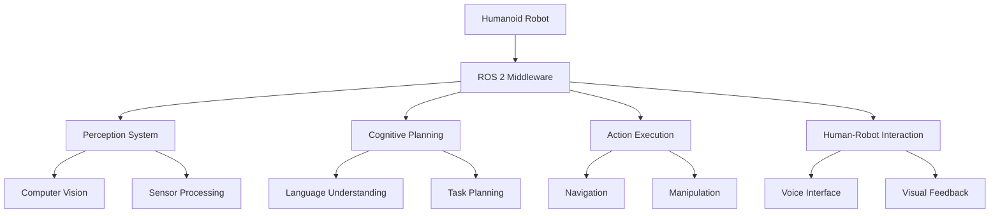

# Capstone Project Implementation Guide

## Introduction

This guide provides a detailed, step-by-step approach to implementing your autonomous humanoid robot for the capstone project. We'll build the system incrementally, integrating components from each module while ensuring proper communication and coordination.

## Phase 1: System Architecture Design

### 1.1 Define System Components

First, let's define the major components of our system:



### 1.2 Establish Communication Patterns

Define how components will communicate using ROS 2:

- **Topics**: For streaming data (sensor data, camera feeds, status updates)
- **Services**: For synchronous requests (object recognition, path planning)
- **Actions**: For long-running tasks (navigation, manipulation)

### 1.3 Create Package Structure

```bash
capstone_robot/
├── capstone_bringup/
├── capstone_perception/
├── capstone_planning/
├── capstone_control/
├── capstone_interfaces/
└── capstone_launch/
```

## Phase 2: Component Implementation

### 2.1 Implement Perception System

Create the perception system that integrates computer vision and sensor processing:

```python
# capstone_perception/capstone_perception/perception_node.py
import rclpy
from rclpy.node import Node
from sensor_msgs.msg import Image, PointCloud2
from vision_msgs.msg import Detection2DArray
from capstone_interfaces.msg import EnvironmentState

class PerceptionNode(Node):
    def __init__(self):
        super().__init__('perception_node')

        # Subscribers
        self.image_sub = self.create_subscription(
            Image, '/camera/rgb/image_raw', self.image_callback, 10)
        self.pointcloud_sub = self.create_subscription(
            PointCloud2, '/camera/depth/points', self.pointcloud_callback, 10)

        # Publishers
        self.detection_pub = self.create_publisher(
            Detection2DArray, '/object_detections', 10)
        self.state_pub = self.create_publisher(
            EnvironmentState, '/environment_state', 10)

        # Object detection model
        self.detection_model = self.load_detection_model()

    def image_callback(self, msg):
        # Process image and detect objects
        detections = self.detect_objects(msg)
        self.detection_pub.publish(detections)

        # Update environment state
        state = self.update_environment_state(detections)
        self.state_pub.publish(state)

    def detect_objects(self, image_msg):
        # Implementation of object detection
        pass

    def update_environment_state(self, detections):
        # Update environment state based on detections
        pass
```

### 2.2 Implement Cognitive Planning System

Create the cognitive planning system that processes natural language commands:

```python
# capstone_planning/capstone_planning/planning_node.py
import rclpy
from rclpy.node import Node
from std_msgs.msg import String
from capstone_interfaces.msg import TaskPlan, EnvironmentState
import openai
import json

class PlanningNode(Node):
    def __init__(self):
        super().__init__('planning_node')

        # Subscribers
        self.command_sub = self.create_subscription(
            String, '/voice_command', self.command_callback, 10)
        self.state_sub = self.create_subscription(
            EnvironmentState, '/environment_state', self.state_callback, 10)

        # Publishers
        self.plan_pub = self.create_publisher(TaskPlan, '/task_plan', 10)

        # Store environment state
        self.current_state = None

        # Initialize OpenAI client
        self.openai_client = openai.OpenAI(api_key="YOUR_API_KEY")

    def command_callback(self, msg):
        # Process natural language command
        command = json.loads(msg.data)
        plan = self.generate_task_plan(command['command'], self.current_state)
        self.plan_pub.publish(plan)

    def state_callback(self, msg):
        # Update current environment state
        self.current_state = msg

    def generate_task_plan(self, command, state):
        # Use LLM to generate task plan based on command and state
        prompt = f"""
        Given the current environment state: {state}
        And the user command: {command}

        Generate a step-by-step task plan for the humanoid robot to execute.
        The plan should include navigation, manipulation, and interaction steps.
        Return the plan in a structured format.
        """

        response = self.openai_client.chat.completions.create(
            model="gpt-4",
            messages=[{"role": "user", "content": prompt}],
            temperature=0.3
        )

        plan_data = json.loads(response.choices[0].message.content)
        return self.create_task_plan_msg(plan_data)
```

### 2.3 Implement Action Execution System

Create the action execution system that carries out the planned tasks:

```python
# capstone_control/capstone_control/action_execution_node.py
import rclpy
from rclpy.node import Node
from capstone_interfaces.msg import TaskPlan, ExecutionStatus
from geometry_msgs.msg import PoseStamped
from moveit_msgs.action import MoveGroup
from rclpy.action import ActionClient

class ActionExecutionNode(Node):
    def __init__(self):
        super().__init__('action_execution_node')

        # Subscribers
        self.plan_sub = self.create_subscription(
            TaskPlan, '/task_plan', self.plan_callback, 10)

        # Publishers
        self.status_pub = self.create_publisher(ExecutionStatus, '/execution_status', 10)

        # Action clients
        self.move_group_client = ActionClient(self, MoveGroup, '/move_group')

        # Current plan
        self.current_plan = None

    def plan_callback(self, msg):
        # Execute the received task plan
        self.current_plan = msg
        self.execute_plan()

    def execute_plan(self):
        # Execute each step in the plan
        for step in self.current_plan.steps:
            if step.type == 'NAVIGATION':
                self.execute_navigation(step)
            elif step.type == 'MANIPULATION':
                self.execute_manipulation(step)
            elif step.type == 'INTERACTION':
                self.execute_interaction(step)

    def execute_navigation(self, step):
        # Navigate to the specified location
        goal_pose = PoseStamped()
        goal_pose.pose.position.x = step.target_x
        goal_pose.pose.position.y = step.target_y
        goal_pose.pose.orientation.w = 1.0

        # Use navigation stack to reach goal
        pass

    def execute_manipulation(self, step):
        # Manipulate objects using robot arms
        pass

    def execute_interaction(self, step):
        # Interact with the environment
        pass
```

## Phase 3: System Integration

### 3.1 Create Launch File

Create a launch file to bring up the entire system:

```python
# capstone_launch/capstone_launch/capstone_system_launch.py
from launch import LaunchDescription
from launch.actions import DeclareLaunchArgument
from launch.substitutions import LaunchConfiguration
from launch_ros.actions import Node

def generate_launch_description():
    # Launch arguments
    use_sim_time = LaunchConfiguration('use_sim_time')

    # Perception node
    perception_node = Node(
        package='capstone_perception',
        executable='perception_node',
        name='perception_node',
        parameters=[{'use_sim_time': use_sim_time}],
        output='screen'
    )

    # Planning node
    planning_node = Node(
        package='capstone_planning',
        executable='planning_node',
        name='planning_node',
        parameters=[{'use_sim_time': use_sim_time}],
        output='screen'
    )

    # Action execution node
    action_node = Node(
        package='capstone_control',
        executable='action_execution_node',
        name='action_execution_node',
        parameters=[{'use_sim_time': use_sim_time}],
        output='screen'
    )

    # Voice interface node
    voice_node = Node(
        package='capstone_interaction',
        executable='voice_interface_node',
        name='voice_interface_node',
        parameters=[{'use_sim_time': use_sim_time}],
        output='screen'
    )

    return LaunchDescription([
        DeclareLaunchArgument(
            'use_sim_time',
            default_value='false',
            description='Use simulation (Gazebo) clock if true'
        ),
        perception_node,
        planning_node,
        action_node,
        voice_node
    ])
```

### 3.2 Implement Safety Systems

Add safety mechanisms to ensure safe operation:

```python
# capstone_control/capstone_control/safety_node.py
import rclpy
from rclpy.node import Node
from sensor_msgs.msg import LaserScan, JointState
from std_msgs.msg import Bool
from builtin_interfaces.msg import Duration

class SafetyNode(Node):
    def __init__(self):
        super().__init__('safety_node')

        # Subscribers
        self.scan_sub = self.create_subscription(
            LaserScan, '/scan', self.scan_callback, 10)
        self.joint_state_sub = self.create_subscription(
            JointState, '/joint_states', self.joint_state_callback, 10)

        # Publishers
        self.emergency_stop_pub = self.create_publisher(Bool, '/emergency_stop', 10)

        # Safety parameters
        self.safety_distance = 0.5  # meters
        self.max_joint_velocity = 1.0  # rad/s

    def scan_callback(self, msg):
        # Check for obstacles in the path
        min_distance = min(msg.ranges)
        if min_distance < self.safety_distance:
            # Emergency stop
            stop_msg = Bool()
            stop_msg.data = True
            self.emergency_stop_pub.publish(stop_msg)

    def joint_state_callback(self, msg):
        # Check joint velocities
        for velocity in msg.velocity:
            if abs(velocity) > self.max_joint_velocity:
                # Emergency stop
                stop_msg = Bool()
                stop_msg.data = True
                self.emergency_stop_pub.publish(stop_msg)
```

## Phase 4: Testing and Validation

### 4.1 Simulation Testing

Test your system in Gazebo simulation before deploying to real hardware:

```bash
# Launch the simulation environment
ros2 launch turtlebot3_gazebo turtlebot3_world.launch.py

# Launch your capstone system
ros2 launch capstone_launch capstone_system_launch.py
```

### 4.2 Real-World Testing

Once validated in simulation, test with real hardware following safety protocols.

## Project Deliverables

Your final capstone project should include:

1. **Complete System**: Fully integrated humanoid robot system
2. **Documentation**: Comprehensive documentation of your implementation
3. **Video Demonstration**: Video showing the system in action
4. **Code Repository**: Well-organized code repository with clear comments
5. **Final Report**: Detailed report explaining your approach, challenges, and solutions

## Conclusion

This capstone project represents the integration of all the concepts you've learned throughout this curriculum. Successfully completing this project will demonstrate your mastery of Physical AI and humanoid robotics, preparing you for advanced work in this exciting field.

Remember to follow safety protocols when working with physical robots, and always test in simulation first. Good luck with your implementation!