# Implementation Plan: Physical AI & Humanoid Robotics Textbook

**Branch**: `feature/physical-ai-robotics-textbook` | **Date**: 2025-12-05 | **Spec**: specs/physical-ai-robotics-textbook/spec.md
**Input**: Feature specification from `/specs/physical-ai-robotics-textbook/spec.md`

## Summary

This plan outlines the technical approach to create a comprehensive Docusaurus-based textbook on Physical AI & Humanoid Robotics. The book will cover ROS 2 fundamentals, digital twin simulation (Gazebo/Unity), NVIDIA Isaac, and Vision-Language-Action (VLA) systems, culminating in an end-to-end capstone project. The Docusaurus site will feature a polished yellow and black UI/UX, be deployable to GitHub Pages, and include runnable code examples.

## Technical Context

**Language/Version**: Python 3.11, ROS 2 Humble, JavaScript/TypeScript (for Docusaurus)
**Primary Dependencies**: Docusaurus, ROS 2, Gazebo, Unity (for visualization concepts), NVIDIA Isaac Sim, Isaac ROS, Nav2, Whisper (or similar ASR), Large Language Models (LLMs)
**Storage**: MDX files for content, images in `/static/img/`, Prompt History Records (PHRs) in `/history/prompts/`
**Testing**: `npm run build` for site compilation, code execution verification for examples, UI/UX visual validation, link integrity checks
**Target Platform**: GitHub Pages (for deployment), Ubuntu 22.04 (for code execution environment)
**Project Type**: Documentation website (Docusaurus)
**Performance Goals**: Fast loading times, responsive UI, efficient Docusaurus build process
**Constraints**: 10–14 chapters (1,000–2,000 words each), all images in `/static/img/`, `npm run build` must pass, clean GitHub Pages deployment, theme must not break build, content technically accurate from official sources, real commands/code for Ubuntu 22.04 / ROS 2 Humble
**Scale/Scope**: A complete textbook covering four major robotics modules with practical examples and a capstone project.

## Constitution Check

*GATE: Must pass before Phase 0 research. Re-check after Phase 1 design.*

- ✅ **I. Spec-Driven Development**: All aspects of this plan are derived directly from the feature specification (`specs/physical-ai-robotics-textbook/spec.md`).
- ✅ **II. Technical Accuracy**: The plan explicitly mandates verification of technical information against official sources and runnable code examples.
- ✅ **III. Clarity & Readability**: Docusaurus is chosen for its focus on clear, structured documentation, aligning with student-friendly explanations and consistent formatting.
- ✅ **IV. Content Integrity**: The plan incorporates checks for zero hallucination and factual content.
- ✅ **V. UI/UX Excellence**: Docusaurus theme customization is central to achieving the specified yellow and black UI/UX requirements.
- ✅ **VI. Maintainability & Deployability**: The plan addresses Docusaurus compatibility, `npm run build` success, and GitHub Pages deployment, ensuring maintainability and deployability.

## Project Structure

### Documentation (this feature)

```text
specs/physical-ai-robotics-textbook/
├── plan.md              # This file (/sp.plan command output)
├── spec.md              # Feature specification
└── tasks.md             # Task list for implementation (/sp.tasks command output)
```

### Source Code (repository root)

```text
docs/
│
├── 01-introduction/
│   └── intro.md
│
├── 02-ros2-foundations/
│   ├── module-1-ros2.md
│   └── ros2-hands-on.md
│
├── 03-simulation/
│   ├── digital-twins.md
│   ├── gazebo-unity.md
│   └── module-2-simulation.md
│
├── 04-hardware-basics/
│   └── module-3-hardware.md
│
├── 05-vla-systems/
│   ├── module-4-vla-foundations.md
│   ├── vla-action.md
│   ├── vla-hands-on-basic.md
│   ├── vla-language.md
│   └── vla-vision.md
│
├── 06-advanced-ai-control/
│   └── module-5-advanced-ai.md
│
├── 07-humanoid-design/
│   └── module-6-humanoid-design.md
│
├── appendix/
│   ├── glossary.md
│   ├── references.md
│   └── resources.md
│
└── intro.md

src/
├── components/          # Docusaurus React components for custom UI/UX (e.g., ModuleCard)
└── theme/               # Docusaurus theme overrides and customizations

static/
├── img/                 # All chapter diagrams and images
└── favicon.ico

.docusaurus/
.github/workflows/       # GitHub Actions for CI/CD (build and deploy to GitHub Pages)
history/prompts/         # Storage for all Prompt History Records (PHRs)
docusaurus.config.js     # Docusaurus main configuration
sidebars.js              # Docusaurus sidebar configuration (auto-generated or manually maintained)
package.json             # Docusaurus dependencies
```

**Structure Decision**: The project will utilize a Docusaurus-native structure, with content organized under `docs/` by module and chapter. Custom UI components and theme overrides will reside in `src/components/` and `src/theme/` respectively. All PHRs will be systematically stored in `history/prompts/`.

## Architecture Sketch

```mermaid
graph TD
    User[User/Student] -- Reads --> DocusaurusSite(Docusaurus Website)
    DocusaurusSite -- Hosted on --> GitHubPages(GitHub Pages)

    subgraph Content Generation Pipeline
        Agent(Claude Code Agent) -- Generates/Writes --> MDXContent[MDX Chapters in docs/]
        Agent -- Generates/Updates --> docusaurusConfig[docusaurus.config.js]
        Agent -- Generates/Updates --> sidebarsJs[sidebars.js]
        Agent -- Generates/Writes --> CustomComponents[src/components/ Custom UI]
        Agent -- Generates/Writes --> ThemeOverrides[src/theme/ Theme Overrides]
        MDXContent -- Includes --> Images(static/img/)
        Agent -- Records --> PHRs[history/prompts/ Prompt History Records]
    end

    subgraph Docusaurus Build & Deployment
        Repo[GitHub Repository] -- Contains --> ContentGenerationPipeline
        Repo -- Triggers --> GHActions(GitHub Actions CI/CD) --> DocusaurusBuild(npm run build)
        DocusaurusBuild -- Outputs --> StaticSite[Build Output]
        StaticSite -- Deploys to --> GitHubPages
    end

    DocusaurusSite -- Displays --> Homepage(Homepage: Title, Desc, CTA)
    DocusaurusSite -- Displays --> ModulesPage(Modules Page: Card-based Navigation)
    ModulesPage -- Links to --> Chapters(Individual Chapters)

    click DocusaurusSite "https://docusaurus.io/"
    click GitHubPages "https://docs.github.com/en/pages"

```



**High-Level System Layout**: The core system revolves around the Claude Code Agent generating MDX content and Docusaurus configuration files. Docusaurus then builds a static website, which is deployed to GitHub Pages via GitHub Actions. User interaction is primarily with the deployed Docusaurus site, consuming the generated textbook content.

**Docusaurus Project Structure**: The structure follows Docusaurus conventions:
-   `docs/`: Contains all chapters and module directories (e.g., `01-introduction/intro.md`).
-   `src/`: Houses custom React components (`src/components/`) and theme overrides (`src/theme/`) for the yellow/black UI/UX.
-   `static/`: Stores all static assets, notably `img/` for diagrams and screenshots.
-   `docusaurus.config.js`: Main configuration for site metadata, plugins, presets, and theme settings.
-   `sidebars.js`: Defines the navigation sidebar structure, which can be auto-generated by Docusaurus or manually managed.

**Key Components**:
-   **Claude Code Agent**: Acts as the content generation engine, writing MDX files, configuring Docusaurus, and maintaining the project history.
-   **Content Generation Pipeline**: The process by which the agent creates and updates textbook chapters, ensuring adherence to structure and technical accuracy.
-   **History Folder (`history/prompts/`)**: A dedicated directory for storing all PHRs, providing an auditable trace of agent interactions and decisions.
-   **Docusaurus**: The static site generator that transforms MDX content and React components into a navigable website.
-   **GitHub Actions**: Automates the build and deployment process from the GitHub repository to GitHub Pages.

**Data Flow**: The Claude Code Agent writes content (MDX, images) and configuration (Docusaurus JS files) to the repository. GitHub Actions picks up these changes, triggers `npm run build` using Docusaurus, and deploys the resulting static files to GitHub Pages. Students access the rendered textbook via the GitHub Pages URL.

**Agent Interactions and File-Writing Workflow**: The agent uses `Write` and `Edit` tools to create and modify MDX chapter files, Docusaurus configuration (`docusaurus.config.js`, `sidebars.js`), and custom React components/theme files. It also uses the `Write` tool to save PHRs in the `/history/prompts/` directory after each significant user interaction.

**Storage Structure**: The repository contains:
-   `docs/`: MDX content, organized by module/chapter.
-   `static/img/`: All images and diagrams.
-   `src/`: Custom Docusaurus components and theme.
-   `/history/prompts/`: All PHRs in Markdown format, following a consistent naming convention.
-   Docusaurus configuration files (`docusaurus.config.js`, `sidebars.js`, `package.json`).

## Section Structure

### I. Docusaurus Documentation Sections (Book Content)

-   **Modules (Categories)**: Top-level organization corresponding to the four main modules (ROS 2, Digital Twin, NVIDIA Isaac, VLA Systems). These will be defined in `sidebars.js` as categories.
-   **Chapters**: Individual MDX files within each module category (e.g., `docs/01-introduction/intro.md`, `docs/02-ros2-foundations/module-1-ros2.md`).
-   **Navigation**: Primary navigation via the Docusaurus sidebar. The homepage and modules page will serve as entry points.
-   **Appendix**: Dedicated section for Glossary, References, and Resources (`docs/appendix/`).

### II. Engineering Modules (Claude Code Agent & Tooling)

-   **Content Generation Module**: Handles parsing user requirements, researching topics, drafting MDX chapter content, and embedding code examples/diagrams.
-   **Docusaurus Configuration Module**: Manages the creation and update of `docusaurus.config.js` and `sidebars.js` to reflect content structure and theme.
-   **File Writer Module**: Utilizes `Write` and `Edit` tools for all file system operations, including MDX chapters, images, and configuration files.
-   **History & Traceability Module**: Responsible for generating and storing PHRs in `history/prompts/`, ensuring full traceability of interactions.
-   **Deployment Automation Module**: Handles the configuration of GitHub Actions for automated Docusaurus build and deployment to GitHub Pages.

### III. UI/UX Sections (Docusaurus Theme & Layout)

-   **Custom Theme (src/theme/)**: Overrides default Docusaurus theme components to implement the yellow/black color palette, rounded elements, and specific typography.
-   **Homepage Layout (src/pages/index.js)**: Custom React component for the hero section with title, description, and CTA button.
-   **Modules Page Layout (src/pages/modules.js)**: Custom React component to render the card-based navigation for module/chapter groups.
-   **CSS Styling (src/css/custom.css)**: Global and component-specific styles for consistent layout and spacing.
-   **Search Functionality**: Utilize Docusaurus's built-in search or integrate a custom solution for content discoverability.

### IV. Data Storage and Versioning Sections

-   **Content Storage**: All textbook content (chapters, images) stored as version-controlled files in the Git repository.
-   **PHR Storage**: PHRs stored as Markdown files in `history/prompts/`, also version-controlled.
-   **Docusaurus Versioning**: Docusaurus's native versioning capabilities will be utilized if the textbook requires distinct versions over time (e.g., for different ROS releases). Initially, a single version will be maintained.
-   **Image Management**: Images stored in `static/img/` and referenced within MDX files. Guidelines for image optimization will be followed.

## Research Approach

We will adopt a research-concurrent method, where research is performed as needed during content generation, rather than a monolithic upfront phase. This ensures that information is highly relevant and up-to-date for the specific chapter being written.

-   **Citation Standard**: All external sources will be cited using APA style (per Constitution) within the MDX content.
-   **Source Prioritization**: Official documentation for ROS 2, Gazebo, Unity, and NVIDIA Isaac will be the primary authoritative sources. Academic papers and reputable community resources will be used for supplementary information.
-   **Relevant References**: Only references directly relevant to the content and verifiable technical accuracy will be included.
-   **Agent-led Search**: The Claude Code Agent will use `WebSearch` and `WebFetch` tools to retrieve documentation and examples as required during content creation.

## Quality Validation

**Success Metrics for AI Book + Docusaurus Site**: The primary success criteria defined in `specs/physical-ai-robotics-textbook/spec.md` will serve as the foundation for quality validation. This includes successful build/deployment, adherence to chapter structure, technical accuracy, UI/UX implementation, and runnable code examples.

-   **Content Formatting Validation**: Automated checks (potentially via Docusaurus plugins or custom scripts) for Markdown quality, correct heading hierarchy, properly embedded images, and syntax-highlighted code blocks.
-   **Navigation Structure Validation**: Manual and automated checks for correct sidebar generation, working internal links, and intuitive navigation flow. Auto-generated sidebars will be preferred to simplify maintenance.
-   **Link Integrity Tests**: Automated scanning for broken internal and external hyperlinks within the Docusaurus site.
-   **Build Success Tests**: Regular execution of `npm run build` in a CI/CD pipeline (GitHub Actions) to ensure zero build errors.
-   **Visual Checks of Sidebar/Navigation**: Manual review of the rendered Docusaurus site to confirm the aesthetic and functional correctness of the sidebar and overall navigation.
-   **Data Persistence Tests for History Folder**: Verification that PHRs are correctly generated, stored in `history/prompts/`, and contain all required metadata (ID, title, stage, prompt, response).
-   **Technical Accuracy Review**: Manual review of generated content against official documentation and runnable code examples to prevent hallucinations and ensure correctness.

## Decisions Needing Documentation

For each major architectural choice, the following will be documented in an Architectural Decision Record (ADR) if the criteria for significance are met (impact, alternatives, scope) and user consent is given:

1.  **Documentation Engine Choice (Docusaurus vs. Alternatives)**
    *   **Options**: Docusaurus, Next.js (with MDX), VuePress, GitBook
    *   **Trade-offs**:
        *   **Docusaurus**: Pros: Markdown-first, excellent documentation features (sidebar, search, versioning), active community, React-based for custom UI. Cons: Can be opinionated, theme customization might require React knowledge.
        *   **Next.js**: Pros: Full React flexibility, powerful SSG. Cons: More setup for documentation features.
    *   **Decision**: Docusaurus. **Reasoning**: Best balance of documentation-specific features, ease of use with Markdown, and flexibility for custom UI/UX requirements.

2.  **Folder Structure for Content**
    *   **Options**: Docusaurus default (`docs/` with categories), custom nested structure.
    *   **Trade-offs**:
        *   **Docusaurus Default**: Pros: Simplifies `sidebars.js` generation, leverages Docusaurus conventions. Cons: Less control over very specific URL paths.
        *   **Custom Nested**: Pros: Fine-grained control. Cons: More manual configuration, potential for breaking Docusaurus conventions.
    *   **Decision**: Docusaurus default `docs/` with nested module directories. **Reasoning**: Aligns with Docusaurus best practices, simplifies auto-generation of sidebars, and provides clear content organization.

3.  **Deployment Target (GitHub Pages vs. Alternatives)**
    *   **Options**: GitHub Pages, Vercel, Netlify, Cloudflare Pages.
    *   **Trade-offs**:
        *   **GitHub Pages**: Pros: Free, tightly integrated with GitHub, simple for static sites. Cons: Limited build capabilities, custom domain setup can be tricky.
        *   **Vercel/Netlify/Cloudflare**: Pros: More advanced build features, easier custom domains, additional CDN benefits. Cons: Potential for cost, separate account management.
    *   **Decision**: GitHub Pages. **Reasoning**: Meets the project's requirement for clean deployment, is cost-free, and simplifies the CI/CD pipeline given the GitHub repository context.

4.  **Sidebar Generation Method**
    *   **Options**: Docusaurus auto-generated (`sidebars.js` `autogenerated`), manual `sidebars.js` configuration.
    *   **Trade-offs**:
        *   **Auto-generated**: Pros: Effortless for content structure changes, always up-to-date with `docs/` content. Cons: Less control over exact order or grouping of items beyond file system structure.
        *   **Manual**: Pros: Full control over display order and nesting. Cons: Requires manual updates for every content change, prone to errors.
    *   **Decision**: Docusaurus auto-generated sidebars initially, with an option for manual override if specific custom ordering becomes critical. **Reasoning**: Prioritizes maintainability and reduces manual effort, especially during rapid content generation.

5.  **Theme Customization Strategy**
    *   **Options**: Minimal CSS overrides, full theme swizzling (replacing Docusaurus components), custom React components.
    *   **Trade-offs**:
        *   **Minimal CSS**: Pros: Quick, low maintenance. Cons: Limited to basic style changes, might not achieve desired UI/UX.
        *   **Full Swizzling**: Pros: Maximum control. Cons: High maintenance (breaks on Docusaurus updates), requires deep React/Docusaurus knowledge.
        *   **Custom React Components**: Pros: Targeted customization, maintainable for specific UI elements. Cons: Requires React development.
    *   **Decision**: A combination of minimal CSS overrides for global styles and custom React components (`src/components/`) for specific UI elements like the Homepage hero and Module Cards page. Theme swizzling will be used sparingly only when absolutely necessary for core Docusaurus component modifications. **Reasoning**: Provides the necessary UI/UX control without incurring excessive maintenance overhead.

6.  **Storage Format for PHR**
    *   **Options**: Markdown, JSON, YAML.
    *   **Trade-offs**:
        *   **Markdown**: Pros: Human-readable, version-control friendly, easy to embed verbatim prompts/responses. Cons: Requires custom parsing for structured data queries.
        *   **JSON/YAML**: Pros: Machine-readable, easy for structured data. Cons: Less human-readable, embedding multi-line prompts/responses can be cumbersome.
    *   **Decision**: Markdown files with YAML front-matter. **Reasoning**: Balances human readability and version control benefits with the ability to store structured metadata, while allowing for easy embedding of multi-line prompts and responses.

## Testing Strategy

-   **Validation Tests (mapped to SC)**:
    *   **SC-001**: Run `npm run build` and verify exit code 0; attempt a test deployment to GitHub Pages (or local build output verification).
    *   **SC-002**: Automated check (scripted) for chapter file presence and basic MDX structure (headings, code blocks, image references). Manual review for clear explanations, practical steps, summary, and glossary.
    *   **SC-003**: Manual review of content against official sources for technical accuracy. Automated check for absence of placeholders (`[TODO]`, `[TKTK]`).
    *   **SC-004**: Visual inspection of the deployed site for yellow/black theme, homepage hero, module cards, and responsiveness across devices (using browser dev tools).
    *   **SC-005**: Automated execution of all embedded code examples in a controlled Ubuntu 22.04 / ROS 2 Humble Docker environment; verify expected output.
    *   **SC-006**: Manual navigation through all modules and the capstone project to ensure completeness and logical flow.
-   **Markdown Correctness Tests**: Utilize markdown linters (e.g., `markdownlint-cli2`) within CI/CD to enforce consistent formatting, check for broken syntax, and ensure adherence to Docusaurus-specific Markdown extensions.
-   **Link Integrity Tests**: Employ a broken link checker (e.g., `docusaurus-plugin-sitemap` with `brokenLinks: 'throw'` or a dedicated tool like `lychee`) to scan all internal and external links.
-   **Build Success Tests**: Integrate `npm run build` into GitHub Actions as a mandatory step for every pull request to catch build failures early.
-   **Visual Checks of Sidebar/Navigation**: Manual review during development and staging to ensure the sidebar correctly reflects content hierarchy and navigation links function as expected.
-   **Data Persistence Tests for History Folder**: Scripted verification after agent interactions that new PHR files are created in `history/prompts/`, are readable, and contain the expected YAML front-matter and content (prompt/response text).

## Phases

### Phase 1: Research & Setup (Foundation)

**Goal**: Establish the Docusaurus project, configure basic theme, and set up initial content structure.

-   T001 Initialize Docusaurus project at repository root.
-   T002 Configure `docusaurus.config.js` with basic project metadata and yellow/black theme variables.
-   T003 Create `src/css/custom.css` for global theme overrides (yellow/black palette, rounded elements).
-   T004 Create `sidebars.js` to auto-generate navigation based on `docs/` folder structure.
-   T005 Create `docs/01-introduction/intro.md` for the textbook introduction.
-   T006 Create initial homepage (`src/pages/index.js`) with title, description, and CTA button.
-   T007 Create initial modules page (`src/pages/modules.js`) with a placeholder for card-based navigation.
-   T008 Configure GitHub Actions for Docusaurus build and deployment to GitHub Pages.
-   T009 Verify `npm run build` passes locally.

### Phase 2: Content Generation (Module by Module)

**Goal**: Generate all chapters for each of the four core modules, ensuring technical accuracy, complete structure, and runnable code examples.

-   T010 Generate all chapters for **Module 1 - ROS 2 Foundations** in `docs/02-ros2-foundations/` following `FR-001` and `FR-005`.
-   T011 Generate all chapters for **Module 2 - Digital Twin Simulation** in `docs/03-simulation/` following `FR-002` and `FR-005`.
-   T012 Generate all chapters for **Module 3 - NVIDIA Isaac** in `docs/04-hardware-basics/` and `docs/05-vla-systems/` (adjusting for conceptual flow) following `FR-003` and `FR-005`.
-   T013 Generate all chapters for **Module 4 - Vision-Language-Action Systems** including the end-to-end capstone in `docs/06-advanced-ai-control/` and `docs/07-humanoid-design/` (adjusting for conceptual flow) following `FR-004`, `FR-005`, and `FR-018`.
-   T014 Generate appendix chapters (glossary, references, resources) in `docs/appendix/`.
-   T015 Ensure all images referenced in chapters are stored in `static/img/` and optimized.
-   T016 Verify technical accuracy of all content against official sources (ROS 2, Gazebo, Isaac) `SC-003`.
-   T017 Validate all code examples are runnable in Ubuntu 22.04 / ROS 2 Humble environment `SC-005`.

### Phase 3: UI/UX Refinement & Testing

**Goal**: Implement the custom UI/UX elements and rigorously test the deployed site for functionality, appearance, and responsiveness.

-   T018 Refine homepage (`src/pages/index.js`) to fully match UI/UX requirements for title, description, CTA, and yellow/black accents `FR-007`, `SC-004`.
-   T019 Implement card-based navigation on the modules page (`src/pages/modules.js`) linking to relevant chapter groups `FR-008`, `SC-004`.
-   T020 Conduct visual inspection of the entire site to ensure consistent yellow/black theme, rounded elements, and typography `FR-006`, `SC-004`.
-   T021 Test site responsiveness across desktop and mobile devices `FR-009`, `SC-004`.
-   T022 Perform link integrity tests across all chapters and navigation elements.
-   T023 Verify `npm run build` still passes after UI/UX changes `FR-013`, `FR-015`, `SC-001`.

### Phase 4: Finalization & Deployment

**Goal**: Ensure the textbook is ready for public consumption, including final checks and successful deployment.

-   T024 Conduct a comprehensive review of all chapters for clarity, consistency, and completeness `SC-002`.
-   T025 Verify all success criteria (`SC-001` through `SC-006`) are met.
-   T026 Execute final `npm run build` and deploy to GitHub Pages via GitHub Actions `FR-014`, `SC-001`.
-   T027 Confirm successful deployment and accessibility of the textbook on GitHub Pages.
-   T028 Generate and store all remaining PHRs for the entire development process in `history/prompts/`.

